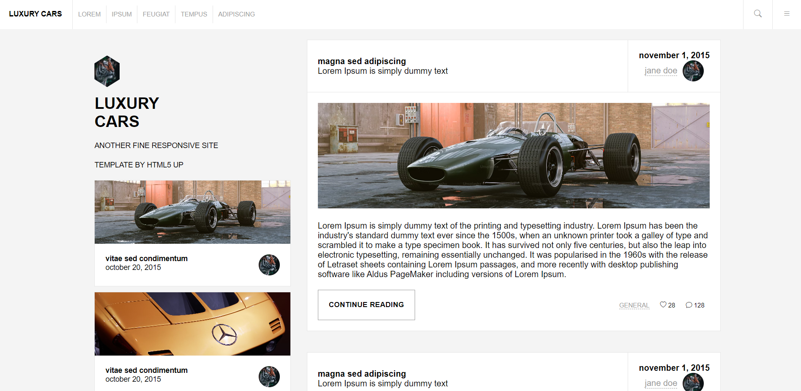

    

# luxurycars
L'objectif de ce projet est de reproduire une maquette (png) au format HTML/CSS

Concernant les images/icons j'ai utilisé les ressources suivantes : 

### images
https://unsplash.com/

### icons
https://icons.getbootstrap.com/